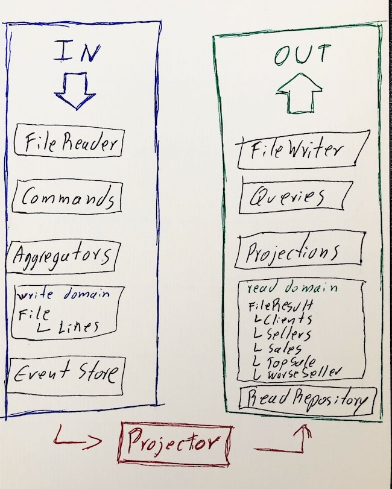

### Kop Event Sourcing and CQRS sandbox

The main purpose of this App is to attend a code challenge, however, do it playing around with some interesting patterns like CQRS and Event Sourcing.

## The business
The system should be able to read files, manage their content, process it, and put it out in another files, based on some predefined standards.

(the original rules are omitted here for now)

## Running
It's basic Java application, using Maven to manage the packages and letting a easy way to run it.

### requirements
- Java 11 +
- Maven 3.6 +

### ready, set, go!
`mvn package` to setup the whole thing, download dependencies, build everything, run the tests...

`mvn exec:java` to run the app

### properties
for now there are just two properties, the name of directories for input and output, and it is stored at the file `kop-app.properties`
but basically it has been initialized like this:
`input=src/main/resources/files/in` 

`output=src/main/resources/files/out`

## The strategy

As written before, it's a experiment using CQRS and EventSourcing, follows here an image of the whole idea

## What could be improved?

yes... a lot of things:
- the exceptions/errors handling is quite poor, must be improved
- split the logic inside of Projector class, there are too many responsabilities
- better test coverage
- stop using magic numbers/texts and put those on properties making it handy
- run the solution by docker, making it able to be placed in containers managers
- create a "second level" os events, where the data is already into different domains
- if we're going to add add more complexity, it would be nice to have a smarter "state retrieve" to replay all events to get what is needed
- make use of an external event store tool (rabbit, kafka...), the good part: it's already isolated in code
- probably in large scale the "readRepo" would be some real database (mongo, postgres...)
 